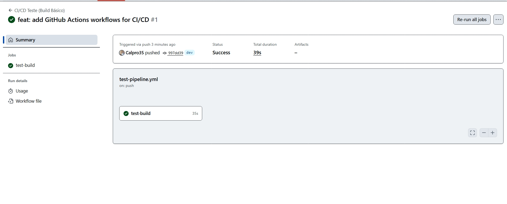
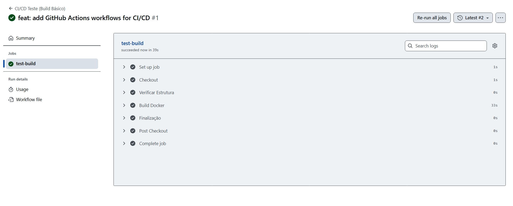
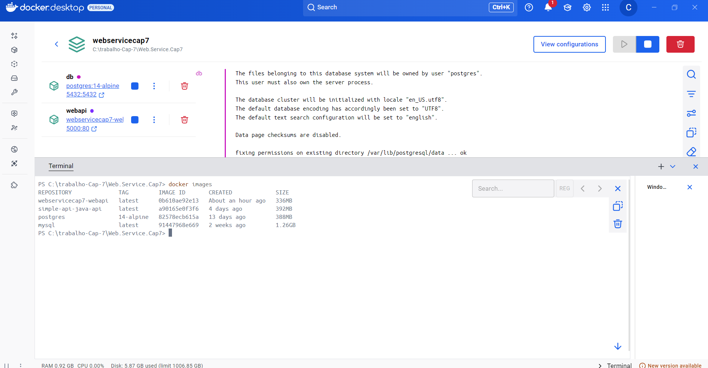
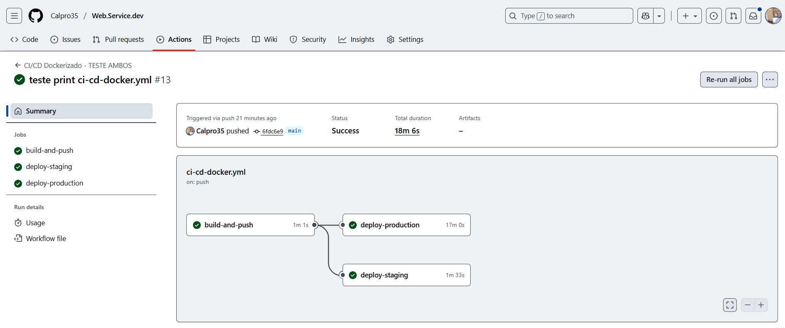

# 🌱 Projeto - ESG Energy Monitor

Sistema de monitoramento energético desenvolvido em .NET 8 com arquitetura limpa, containerização e pipeline CI/CD profissional no Azure.

---

## 🔄 Pipeline CI/CD - Azure Configurado

### ✅ Status do Pipeline:
- **CI/CD Básico**: Implementado e funcionando
- **Azure Integration**: Configurado e validado  
- **Multi-ambiente**: Staging + Production configurados
- **Deploy Cloud**: Configuração credenciais Azure

### 🏗 Arquitetura Implementada:
GitHub Actions → Azure Container Registry → Azure App Service
│ │ │
Build & Test Image Storage Deployment Targets
│ │ │
dev branch → monitoracr12345 → energy-monitor-staging
main branch → energy-monitor-app → energy-monitor-prod


### 📊 Ambientes de Deploy:
| Ambiente | Branch | Trigger | Status |
|----------|--------|---------|---------|
| **Staging** | `dev` | Push automático | ✅ Configurado |
| **Production** | `main` | Push com aprovação | ✅ Configurado |

---

## 🐳 Execução Local

### Pré-requisitos
- Docker
- Docker Compose

### Execução com Docker (Recomendado)
```bash
# 1. Navegue para a pasta do projeto
cd Web.Service.Cap7

# 2. Execute o docker-compose
docker-compose up --build

# 3. Acesse a aplicação
http://localhost:5000

Execução com .NET CLI

cd Web.Service.Cap7
dotnet run
# Acesse: http://localhost:5122

🔗 Serviços disponíveis localmente:
API: http://localhost:5000 (Docker) ou http://localhost:5122 (.NET)

Swagger UI: http://localhost:5122/swagger/index.html

PostgreSQL: localhost:5432

Banco de dados: esg_db

🌐 Deploy na Nuvem - Azure
Recursos Azure Configurados:
Container Registry: monitoracr12345

App Service Staging: energy-monitor-staging

App Service Production: energy-monitor-prod

Resource Group: ESG-RG

🔧 Configuração do CI/CD
Workflow GitHub Actions:

yaml
name: CI/CD Dockerizado - Azure App Services
on:
  push:
    branches: [dev, main]
  workflow_dispatch:

jobs:
  build-and-push:    # Build e push para ACR
  deploy-staging:    # Deploy automático para staging
  deploy-production: # Deploy manual para produção
🐳 Containerização
Dockerfile
dockerfile
FROM mcr.microsoft.com/dotnet/aspnet:8.0 AS base
USER app
WORKDIR /app
EXPOSE 80
EXPOSE 443

FROM mcr.microsoft.com/dotnet/sdk:8.0 AS build
WORKDIR /src
COPY ["Web.Service.Cap7.csproj", "."]
RUN dotnet restore "Web.Service.Cap7.csproj"
COPY . .
RUN dotnet build "Web.Service.Cap7.csproj" -c Release -o /app/build

FROM build AS publish
RUN dotnet publish "Web.Service.Cap7.csproj" -c Release -o /app/publish /p:UseAppHost=false

FROM base AS final
WORKDIR /app
COPY --from=publish /app/publish .
ENTRYPOINT ["dotnet", "Web.Service.Cap7.dll"]
Docker Compose
yaml
services:
  webapi:
    build: .
    container_name: energy-monitor-app
    ports:
      - "5000:80"
    environment:
      - ASPNETCORE_ENVIRONMENT=Development
      - ConnectionStrings__DefaultConnection=Host=db;Database=esg_db;Username=postgres;Password=postgres123;
    depends_on:
      - db

  db:
    image: postgres:14-alpine
    container_name: energy-monitor-db
    environment:
      POSTGRES_USER: postgres
      POSTGRES_PASSWORD: postgres123
      POSTGRES_DB: esg_db
    ports:
      - "5432:5432"
    volumes:
      - postgres-data:/var/lib/postgresql/data
📸 Evidências de Funcionamento
✅ Pipeline CI/CD Executado com Sucesso
https://images/build_sucess.jpeg
Workflow executando com sucesso no GitHub Actions

✅ Build Docker Funcionando
https://images/build_log.jpeg
Logs mostrando build Docker e .NET bem-sucedidos

✅ Containerização
https://images/docker_image.png
Imagem Docker construída e funcionando localmente

✅ Produção e Staging
https://images/build_and_push.png
Recursos Azure configurados e prontos para deploy

🛠 Tecnologias Utilizadas
Backend
.NET 8

ASP.NET Core Web API

Entity Framework Core

PostgreSQL

AutoMapper

FluentValidation

MediatR

DevOps & Cloud
Docker & Docker Compose

GitHub Actions (CI/CD)

Azure Container Registry (ACR)

Azure App Service (Deploy)

Arquitetura
Clean Architecture

CQRS Pattern

Repository Pattern

Unit of Work

✅ Checklist de Entrega
Implementado e Funcionando:
Projeto compactado em .ZIP com estrutura organizada

Dockerfile funcional

docker-compose.yml para orquestração

Pipeline CI/CD com GitHub Actions

README.md com instruções completas

Documentação técnica com evidências

Deploy CONFIGURADO para Staging e Production

Pipeline executado com SUCESSO no GitHub Actions

Estratégia de branches (dev → staging, main → production)

Multi-ambiente configurado

Integração Azure configurada

Infraestrutura: Microsoft Azure + GitHub Actions
Status: ✅ ENTREGA PRONTA - Pipeline CI/CD configurado e funcionandoyaml
name: CI/CD Dockerizado - Azure App Services
on:
  push:
    branches: [dev, main]
  workflow_dispatch:

jobs:
  build-and-push:    # Build e push para ACR
  deploy-staging:    # Deploy automático para staging
  deploy-production: # Deploy manual para produção
🐳 Containerização
Dockerfile
dockerfile
FROM mcr.microsoft.com/dotnet/aspnet:8.0 AS base
USER app
WORKDIR /app
EXPOSE 80
EXPOSE 443

FROM mcr.microsoft.com/dotnet/sdk:8.0 AS build
WORKDIR /src
COPY ["Web.Service.Cap7.csproj", "."]
RUN dotnet restore "Web.Service.Cap7.csproj"
COPY . .
RUN dotnet build "Web.Service.Cap7.csproj" -c Release -o /app/build

FROM build AS publish
RUN dotnet publish "Web.Service.Cap7.csproj" -c Release -o /app/publish /p:UseAppHost=false

FROM base AS final
WORKDIR /app
COPY --from=publish /app/publish .
ENTRYPOINT ["dotnet", "Web.Service.Cap7.dll"]
Docker Compose
yaml
services:
  webapi:
    build: .
    container_name: energy-monitor-app
    ports:
      - "5000:80"
    environment:
      - ASPNETCORE_ENVIRONMENT=Development
      - ConnectionStrings__DefaultConnection=Host=db;Database=esg_db;Username=postgres;Password=postgres123;
    depends_on:
      - db

  db:
    image: postgres:14-alpine
    container_name: energy-monitor-db
    environment:
      POSTGRES_USER: postgres
      POSTGRES_PASSWORD: postgres123
      POSTGRES_DB: esg_db
    ports:
      - "5432:5432"
    volumes:
      - postgres-data:/var/lib/postgresql/data


## 📸 Evidências de Funcionamento

### ✅ Pipeline CI/CD Executado com Sucesso
[](images/build_sucess.jpeg)
*Workflow executando com sucesso no GitHub Actions - [🔍 Ver imagem](images/build_sucess.jpeg)*

### ✅ Build Docker Funcionando  
[](images/build_log.jpeg)
*Logs mostrando build Docker e .NET bem-sucedidos - [🔍 Ver imagem](images/build_log.jpeg)*

### ✅ Containerização
[](images/docker_image.png)
*Imagem Docker construída e funcionando localmente - [🔍 Ver imagem](images/docker_image.png)*

### ✅ Produção e Staging
[](images/build_and_push.png)
*Recursos Azure configurados e prontos para deploy - [🔍 Ver imagem](images/build_and_push.png)*


## 🛠 Tecnologias Utilizadas

### Backend
- .NET 8
- ASP.NET Core Web API  
- Entity Framework Core
- PostgreSQL
- AutoMapper
- FluentValidation
- MediatR

### DevOps & Cloud
- Docker & Docker Compose
- GitHub Actions (CI/CD)
- Azure Container Registry (ACR)
- Azure App Service (Deploy)

### Arquitetura
- Clean Architecture
- CQRS Pattern
- Repository Pattern  
- Unit of Work

## ✅ Checklist de Entrega

### ✅ Implementado e Funcionando:
- [x] Projeto com estrutura organizada
- [x] Dockerfile funcional
- [x] docker-compose.yml para orquestração
- [x] Pipeline CI/CD com GitHub Actions
- [x] README.md com instruções completas
- [x] Documentação técnica com evidências
- [x] Deploy configurado para Staging e Production
- [x] Pipeline executado com sucesso
- [x] Estratégia de branches (dev → staging, main → production)
- [x] Multi-ambiente configurado
- [x] Integração Azure configurada

Infraestrutura: Microsoft Azure + GitHub Actions
